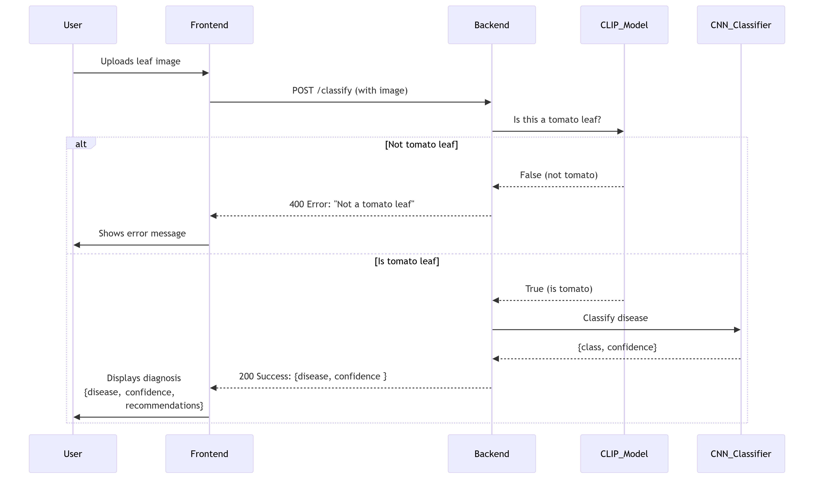
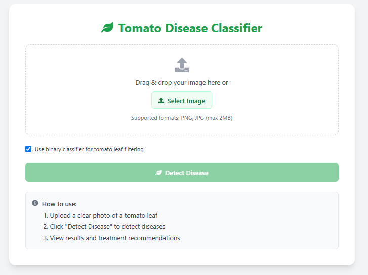
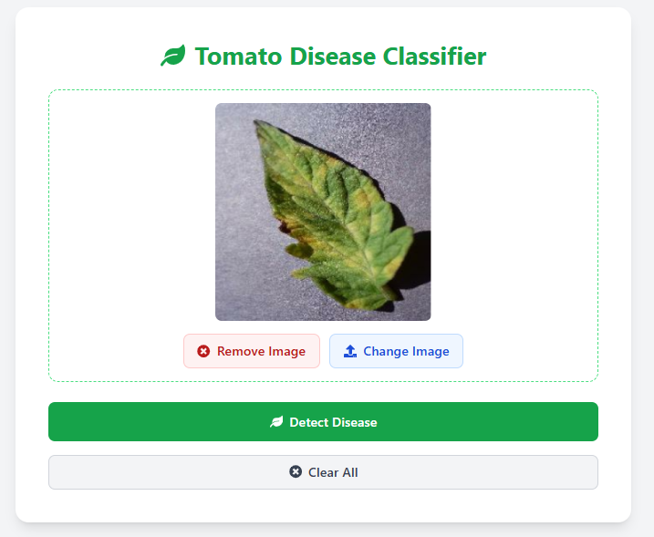

# 🍅 Tomato Disease Classifier

A lightweight web-based tool for identifying diseases in tomato plant leaves using deep learning. It verifies the image using a **CLIP model** to ensure it's a tomato leaf and then uses a **CNN** to classify one of four tomato leaf diseases. The result includes disease info, confidence, severity level, and treatment recommendations.

## 🚀 Features

- ✅ Upload validation (JPG/PNG under 2MB)

- 🧠 CLIP-based filtering (rejects non-tomato leaf images)

- 🌿 CNN model for classifying 4 tomato leaf diseases

- 📊 Confidence score with prediction

- 🎨 Color-coded severity levels (low/medium/high)

- 💊 Treatment recommendations based on diagnosis

- 📱 Modern UI

## 🖼️ Workflow Architecture

📌 Diagram



### 🔁 Step-by-Step Process

```text
1. [User] Uploads image (JPG/PNG <2MB)
2. [Frontend] Validates file type/size
3. [Backend] Receives image via POST /classify
4. [CLIP Model] Verifies tomato leaf (yes/no)
   ├─ If no → Returns error
5. [CNN Model] Classifies disease (4-class output)
6. [Backend] Formats response
7. [Frontend] Displays results:
   ├─ Disease name
   ├─ Confidence score
   ├─ Severity level
   └─ Treatment recommendations
```

## 🤖 Model Info

### CLIP Model

- Model: `clip-vit-base-patch32` (OpenAI)

- Purpose: Binary classification — tomato leaf vs not tomato leaf

- Filtering: Text/image similarity with phrases like “a photo of a tomato leaf”

- Confidence threshold: Configurable (default = 0.65)

### CNN Disease Classifier

- Framework: TensorFlow (Keras)

- Dataset: `PlantVillage`

- Input: 256×256 RGB images

- Augmentation: Rotations, flips, zoom

- Output: One of 4 tomato disease classes

- Accuracy: ~97% on validation set

- Exported as: `tomato_disease_classifier.keras`

## 📷 Screenshots

### 📝 Upload Form



### 🔍 Image Preview



### ✅ Result with Confidence & Tips


## 🔧 Tech Stack

- **Frontend**: React, Tailwind CSS, DaisyUI

- **Backend**: FastAPI (Python)

- **ML Models**:

  - OpenAI CLIP (`clip-vit-base-patch32`)

  - Custom CNN (TensorFlow/Keras)

## 🗂 Project Structure

```bash
tomato-disease-classifier/
│
├── backend/
│   ├── main.py                   # FastAPI app with CLIP filter + TF classifier
│   ├── model/
│   │   └── tomato_disease_classifier.keras
│   ├── utils/
│   │   └── tomato_leaf_detector.py  # CLIP-based filtering function
│   └── requirements.txt
│
├── frontend/
└── README.md
```

## 📦 Prerequisites

Before running the Tomato Disease Classifier, ensure you have the following installed on your system:

## 🖥 System Requirements

- Python ≥ 3.8

- Node.js ≥ 16.x (for frontend build)

- npm (comes with Node.js)

- pip (Python package installer)

## ✅ Verify Installation

```bash
python --version
node --version
npm --version
git --version
```

## ⚙️ Project Setup

### 🧬 Clone the Repo

```bash
git clone https://github.com/yourusername/tomato-disease-classifier.git
cd tomato-disease-classifier
```

### 🖼️ Frontend Setup

```bash
cd frontend
npm install
npm run build
cd..
```

✅ This builds the production-ready frontend files into the `/dist` directory, which the backend uses to serve the SPA.

### 🧠 Backend Setup

```bash
cd backend
python -m venv venv
venv/Scripts/activate

pip install -r requirements.txt
```

### ▶️ Run the App

```bash
uvicorn main:app --port 5000
```

### 🌐 Access the App

- 🧪 Web UI: [http://localhost:5000](http://localhost:5000)

- 📚 API Docs (Swagger): [http://localhost:5000/docs](http://localhost:5000/docs)

## 📮 API Endpoint

`POST /classify`
**Request**:

- `Content-Type: multipart/form-data`

- `file`: PNG or JPG image (max 2MB)

**Response**:

```json
{
  "class": "Tomato_Late_blight",
  "confidence": 0.95
}
```

## 🧑‍💻 Author

Built with 💚 by Melos
