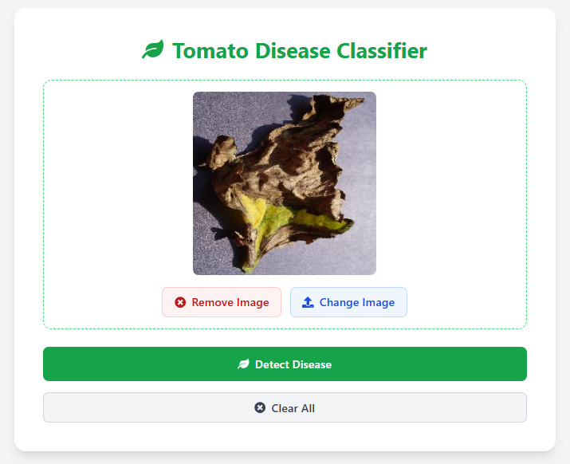

# 🍅 Tomato Disease Classifier

A lightweight web-based tool for identifying diseases in tomato plant leaves using deep learning. It first filters images using a **CLIP model** to confirm the presence of a leaf or plant, then applies a **binary CNN** to verify it's a tomato leaf. If valid, a **multi-class CNN** classifies the image into one of four tomato leaf diseases, providing the predicted disease, confidence score, severity level, and treatment suggestions.

## 🚀 Features

- ✅ Upload validation (JPG/PNG under 2MB)

- 🧠 CLIP + Binary Classifier(optional) filtering (rejects non-tomato leaf images)

- 🌿 CNN model for classifying 4 tomato leaf diseases

- 📊 Confidence score with prediction

- 🎨 Color-coded severity levels (low/medium/high)

- 💊 Treatment recommendations based on diagnosis

- 📱 Modern UI

## 🖼️ Workflow Architecture

### 📌 Diagram


### 🔁 Step-by-Step Process

```text
1. [User] Uploads image (JPG/PNG <2MB)
2. [Frontend] Validates file type/size
3. [Backend] Receives image via POST /classify
4. [Backend] Filter Stage (CLIP + Binary Classifier(optional))
   ├─ CLIP checks if image contains plant leaf:
   │   ├─ No → Returns 400: "Not a tomato leaf"
   │   └─ Yes → Proceeds
   │
   └─ Binary classifier verifies tomato leaf:
       ├─ No → Returns 400: "Not a tomato leaf"
       └─ Yes → Sends to CNN

5. [CNN Model] Classifies disease (4-class output)
6. [Backend] Formats response
7. [Frontend] Displays results:
   ├─ Disease name
   ├─ Confidence score
   ├─ Severity level
   └─ Treatment recommendations
```

## 🤖 Model Info

### 🧠 CLIP + Binary Classifier (`optional`) (Filtering Stage)

- **CLIP Model** (`clip-vit-base-patch32` + `nlpconnect/vit-gpt2-image-captioning`, OpenAI):
Performs initial filtering using text-image similarity with prompts like “a photo of a tomato leaf” to check if the image contains a plant or leaf.

- **Binary CNN Classifier**:
Further refines the filter by verifying whether the detected leaf is specifically a tomato leaf.

- **Purpose**:
Combined, these models ensure only valid tomato leaf images are passed to the disease classification stage.

### 🔬 CNN Disease Classifier

- Framework: TensorFlow (Keras)

- Dataset: `PlantVillage`

- Input: 256×256 RGB images

- Augmentation: Rotations, flips, zoom

- Output: One of 4 tomato disease classes

- Accuracy: ~97% on validation set

- Exported as: `tomato_disease_classifier.keras`

## 📂 Datasets & Model Training

## 🗃 Dataset Location

All datasets used for training both the binary and multi-class CNN classifiers are located in:

```text
backend/data/
```

- `BinaryPlantVillage.zip` – For binary classification (tomato leaf vs non-tomato leaf)

- `PlantVillage.zip` – For multi-class disease classification (4 tomato leaf diseases from PlantVillage)

## 📓 Training Notebooks

The model training code (in Colab format) is available locally in the repository:

```text
backend/training/
```

- `binary_classifier_training.ipynb` – Training notebook for the tomato leaf **binary classifier**

- `disease_classifier_training.ipynb` – Training notebook for the **multi-class disease classifier**

You can open and run these notebooks locally using Google Colab.

## 📷 Screenshots

### 📝 Upload Form


### 🔍 Image Preview



### ✅ Result with Confidence & Tips


## 🔧 Tech Stack

- **Frontend**: React, Tailwind CSS, DaisyUI

- **Backend**: FastAPI (Python)

- **ML Models**:

  - OpenAI CLIP (`clip-vit-base-patch32`+`nlpconnect/vit-gpt2-image-captioning`)

  - Binary CNN (TensorFlow/Keras)
  
  - Multi-class CNN (TensorFlow/Keras)

## 🗂️ Project Structure

```bash
tomato-disease-classifier/
│
├── backend/
│   ├── main.py                   # FastAPI app with filter + TF classifier
│   ├── model/
│   │   └── tomato_disease_classifier.keras
│   ├── utils/
│   │   └── tomato_leaf_detector.py  # CLIP + Binary-based filtering function
│   └── requirements.txt
│
├── frontend/
└── README.md
```

## 📦 Prerequisites

Before running the Tomato Disease Classifier, ensure you have the following installed on your system:

## 💻 System Requirements

- Python ≥ 3.8

- Node.js ≥ 16.x (for frontend build)

- npm (comes with Node.js)

- pip (Python package installer)

## ✅ Verify Installation

```bash
python --version
node --version
npm --version
git --version
```

## ⚙️ Project Setup

### 🧬 Clone the Repo

```bash
git clone https://github.com/yourusername/tomato-disease-classifier.git
cd tomato-disease-classifier
```

### 🖼️ Frontend Setup

```bash
cd frontend
npm install
npm run build
cd..
```

This builds the production-ready frontend files into the `/dist` directory, which the backend uses to serve the SPA.

### 🧠 Backend Setup

```bash
cd backend
python -m venv venv
venv/Scripts/activate

pip install -r requirements.txt
```

### ▶️ Run the App

```bash
uvicorn main:app --port 5000
```

### 🌐 Access the App

- 🧪 Web UI: [http://localhost:5000](http://localhost:5000)

- 📚 API Docs (Swagger): [http://localhost:5000/docs](http://localhost:5000/docs)

## 📮 API Endpoint

`POST /classify`
**Request**:

- `Content-Type: multipart/form-data`

- `file`: PNG or JPG image (max 2MB)

**Response**:

```json
{
  "class": "Tomato_Late_blight",
  "confidence": 0.95
}
```

## 👨‍💻 Author

Built with 💚 by Melos
